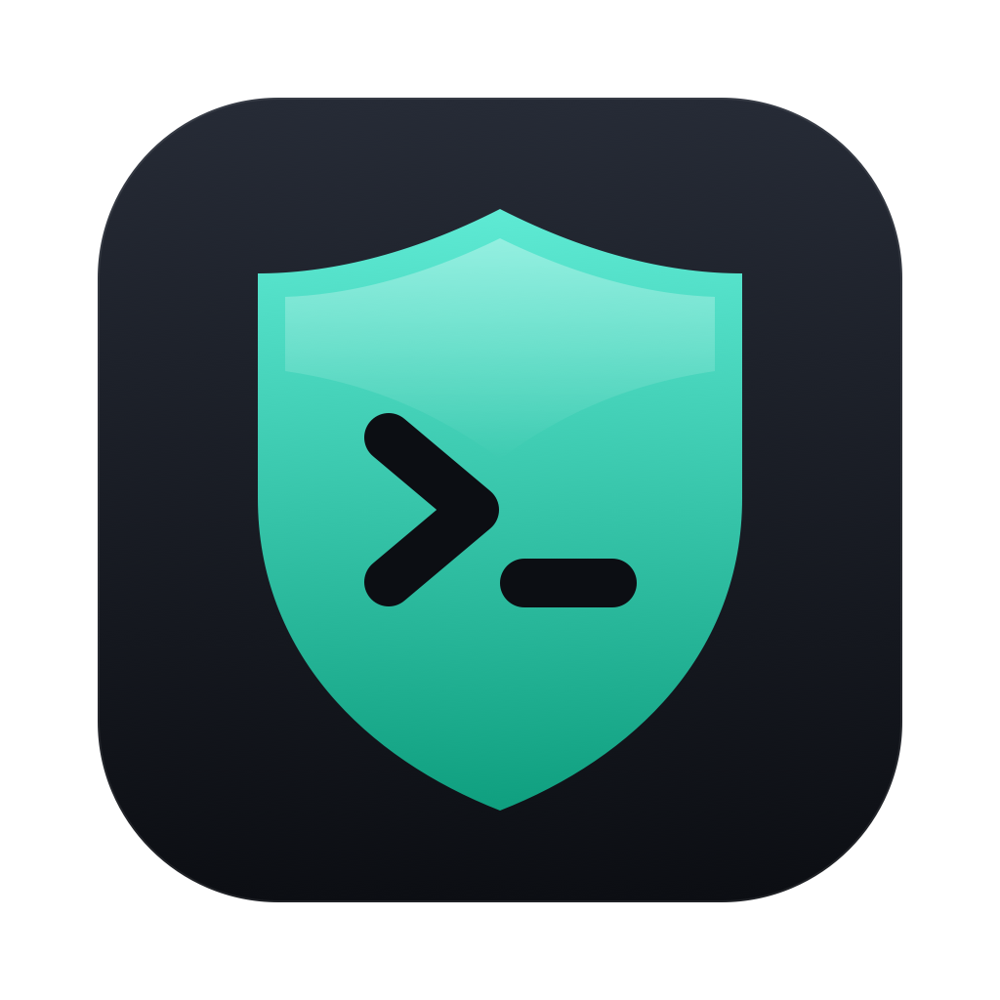

# OpenCode Guard

Guardrails for [OpenCode](https://opencode.ai) on macOS. Agents keep full tool permissions and broad read access, but can only change or delete files in folders you allow, can never touch folders you deny, and cannot edit the guard itself.

No dependencies beyond macOS 15 or later. No admin password.

## Install

1. Download [`OpenCodeGuard.dmg`](https://github.com/ebrindley/OpenCodeGuard/releases/latest/download/OpenCodeGuard.dmg) (or the [`.zip`](https://github.com/ebrindley/OpenCodeGuard/releases/latest/download/OpenCodeGuard.zip)) and open it.
2. Double-click **Install OpenCode Guard**. macOS blocks unsigned downloads the first time: open **System Settings → Privacy & Security** and click **Open Anyway**.
3. Choose your projects folder. At the end, click **Edit List** to review your allow and deny list.

From a terminal: `zsh install.sh` in a clone of this repository.

Then start OpenCode with **OpenCode Guard** (in `~/Applications`, drag it to the Dock) or type `opencode` in a new terminal window.

## The list

`~/OpenCode Guard/Guard List.txt` — one folder or file per line under a heading. Drag items in from Finder or type paths starting with `/` or `~`. Changes apply the next time OpenCode starts.

| Heading | Agents may |
|---|---|
| `ALLOW` | read, create, change, delete inside (the folder itself cannot be removed or renamed) |
| `READ ONLY` | read and search only |
| `DENY` | nothing: no reading, searching, changing or deleting |

DENY always wins. Between ALLOW and READ ONLY, the more specific path wins. Folders above a DENY or READ ONLY entry cannot be renamed or removed. `/`, your home folder, `~/Library`, `~/.config` and `~/.local` cannot be allowed as a whole, and folders OpenCode needs (such as your home folder) cannot be made READ ONLY or DENY; everything outside ALLOW is read-only already.

`~/OpenCode Guard/last-launch.log` shows what applied at the last launch, lines that were skipped or refused, and the locations OpenCode can always write for itself: its data and state folders, caches, npm and Bun caches, and temp folders.

## How it works

- **Sandbox.** OpenCode (CLI and Desktop) runs under a macOS Seatbelt profile built from the list at each launch. Every process OpenCode starts inherits it. Writes are denied everywhere except ALLOW folders and what OpenCode itself needs. DENY blocks reads too. Always protected, including through symlinks: the guard, the list, OpenCode's global config, any `.cc-safety-net` settings, shell startup files and LaunchAgents. Also protected: any project `.opencode` folder, `opencode.json` or `tui.json` (these load code at the next start). If one of these is a symlink, its target is protected only when OpenCode is started from that project in a terminal; otherwise only the name is, and the plugin refuses edits through it. Launching apps, `osascript`, `osacompile`, `codesign`, `launchctl`, `diskutil` and `sudo` are blocked.
- **Plugin.** Refuses edits and reads that the list forbids with a clear message, before the sandbox has to, and runs **[cc-safety-net](https://github.com/kenryu42/cc-safety-net)** (bundled, MIT), which blocks common destructive shell commands such as `git reset --hard`, force pushes and recursive `rm` (`rm -rf` also inside `bash -c`, but not `rm -r` without `-f` there). It catches careless commands, not deliberate workarounds such as a Python script that deletes a folder. If OpenCode was started without the guard, every tool that touches files or runs commands is refused. It registers an `opencode_guard_status` tool; the installer's self-test starts OpenCode inside the guard and checks that it is present.

## Limits

- Anything inside an ALLOW folder can be deleted. Keep backups and push your git work.
- Anything inside an ALLOW folder can also be changed, including git hooks and build scripts that run later when you use that project outside the guard, and dotfiles symlinked into it (for example a `~/.gitconfig` kept in a dotfiles repo), except the shell startup files.
- Agents cannot edit project `.opencode` folders or `opencode.json` and `tui.json` files; do that yourself.
- Reads are broad by default, including credential folders such as `~/.ssh` and `~/.aws`. Add them under DENY if agents do not need them; git over SSH and cloud CLIs then fail inside the guard. Agents can also read OpenCode's own sign-in file (`~/.local/share/opencode/auth.json`), which cannot be denied because OpenCode needs it.
- Folder names under DENY remain visible in their parent's listing.
- A program an agent compiles itself can still send Apple Events. Blocked programs such as `open` and `osascript` are blocked by path; a copy elsewhere is not. Existing services outside the sandbox (for example Docker, remote MCP servers) are outside its reach.
- Opening links from the Desktop app is blocked while guarded. Sign in to providers by opening OpenCode without the guard, from a folder that is not a project; tools stay disabled in that mode. Do this only when needed: plugins and tools OpenCode keeps in its cache, and project plugins and MCP servers in the current folder, also run then.
- The Desktop app runs with Chromium's own sandbox off (`--no-sandbox`) because it cannot nest inside the guard's sandbox; the guard's sandbox still applies.
- Build tools that keep their own folders in your home (for example `~/.cargo`, `~/go`, `~/Library/pnpm`) fail with "Operation not permitted" until you add those folders under ALLOW.
- The Desktop app's built-in updater cannot install while guarded. Update it without the guard.
- The `opencode` terminal wrapper is added to zsh startup files and, if it exists, `~/.bash_profile` only. Other shells, such as fish, start OpenCode unguarded, where the plugin refuses tools.
- The installer sets `edit`, `bash` and `external_directory` to allow in OpenCode's global config on purpose, so runs outside the guard depend on the plugin to refuse tools. `opencode --pure` or a custom config directory skips the plugins; the sandbox still applies when launched through the guard.
- Automation that runs OpenCode outside the guard on purpose can set `OPENCODE_GUARD_BYPASS=1`.

## Uninstall

`zsh ~/Library/Application\ Support/OpenCodeGuard/uninstall.sh` — removes the guard but leaves your list, the OpenCode config file and `.gitignore` it created, cc-safety-net logs, and the `env` entry it added to cc-safety-net's `transparent_wrappers`. The installer sets `edit`, `bash` and `external_directory` to allow (keeping any finer rules); uninstall restores each one it changed unless you have changed it since. If restoring fails, it keeps a copy of the saved values in `~/OpenCode Guard/`.

## Development

- `zsh test/test.sh` — installs into a throwaway home, checks list parsing, the sandbox, the plugin and the OpenCode self-test, then uninstalls. Runs outside any sandbox; needs `node` and the `opencode` CLI.
- `zsh build.sh` — builds `dist/OpenCodeGuard.dmg` and `dist/OpenCodeGuard.zip`.

## License

MIT. Bundles cc-safety-net 2.4.6 (MIT, `vendor/cc-safety-net/LICENSE`).
